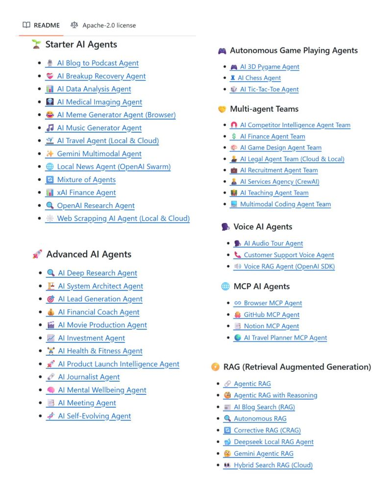

# Machine-Learning
Learn,Roadmap,Projects
Om Nalinde:Linked In profile and below resources

https://www.linkedin.com/in/that-aum/?lipi=urn%3Ali%3Apage%3Ad_flagship3_profile_view_base_recent_activity_content_view%3B89fPTFz2T3K%2F8OislsLrvg%3D%3D

I highly recommend to read this if you're looking to get started in AI or you're looking for a career transition

This books talks about - 

1. AI is the New Literacy
Just as reading and writing became essential skills for society, coding for AI represents a new form of literacy that will be increasingly valuable across all professions. AI and data science have practical applications in almost any field that produces data, making this literacy even more valuable than traditional software engineering.

2. Three-Step Career Framework
Building an AI career follows three key steps: learning foundational skills, working on projects to deepen skills and build a portfolio, and finding a job. These steps build upon each other, with continuous learning throughout the entire process.

3. Essential Technical Skills
The most important technical areas to master include foundational machine learning (linear regression, neural networks, decision trees), deep learning basics, software development skills, and relevant mathematics (linear algebra, probability, statistics). However, you don't need to master everything at once - prioritize based on your goals.

4. Math Requirements Are Contextual
While math knowledge is helpful, the depth required depends on your specific role and goals. As AI tools mature and become more reliable, the mathematical understanding needed for many applications becomes less critical than it once was.

5. Project Scoping Strategy
Successful AI projects start by identifying business problems (not AI problems) first. The five-step process involves: identifying business problems, brainstorming AI solutions, determining milestones, assessing feasibility and value, and budgeting for resources.

6. Start Small and Build Up
Don't expect to work on groundbreaking projects immediately. Begin with small projects in your spare time, gradually building skills and demonstrating value to access larger opportunities and resources over time.

7. Career Switching Strategy
When transitioning into AI, it's easier to switch either your role OR industry, but not both simultaneously. For example, if you're an analyst in finance, consider becoming a data scientist in finance first, then later moving to a tech company.

8. Informational Interviews Are Crucial
Conducting informational interviews with people in your target roles helps you understand what the job actually entails, especially important in AI where job titles can be inconsistent across companies. 

9. Community and Teamwork Matter
Building a supportive community and developing strong interpersonal skills are essential for long-term success. Focus on building genuine relationships and communities.

10. Embrace Continuous Learning
AI is rapidly evolving, making lifelong learning essential. Develop the habit of learning consistently - even small amounts daily can lead to significant progress over time.
Your document has finished loading

Refer : How to Build Your Carrer in AI-Andrew NG.pdf

𝗧𝗵𝗲 𝗯𝗲𝘀𝘁 𝗿𝗼𝗮𝗱𝗺𝗮𝗽 𝘁𝗼 𝗯𝘂𝗶𝗹𝗱 𝗡𝗢-𝗖𝗢𝗗𝗘 𝗔𝗜 𝗔𝗚𝗘𝗡𝗧𝗦 (𝗳𝗿𝗼𝗺 𝘀𝗼𝗺𝗲𝗼𝗻𝗲 𝘄𝗵𝗼 𝗮𝗰𝘁𝘂𝗮𝗹𝗹𝘆 𝗱𝗶𝗱 𝗶𝘁)

📌 𝗦𝘁𝗲𝗽 1: 𝗗𝗲𝗳𝗶𝗻𝗲 𝗣𝘂𝗿𝗽𝗼𝘀𝗲 𝗮𝗻𝗱 𝗦𝘆𝘀𝘁𝗲𝗺 𝗣𝗿𝗼𝗺𝗽𝘁
➜ Use n8n/Make visual prompt builders for clear agent instructions
➜ Define specific use cases and measurable success criteria
➜ Create detailed persona guidelines in platform templates
➜ Test prompts in playground environments before deployment

📌 𝗦𝘁𝗲𝗽 2: 𝗦𝗲𝗹𝗲𝗰𝘁 𝗡𝗼-𝗖𝗼𝗱𝗲 𝗙𝗿𝗮𝗺𝗲𝘄𝗼𝗿𝗸 𝗮𝗻𝗱 𝗟𝗟𝗠
➜ Choose n8n, Make, or Autogen Studio for visual development
➜ Select LLMs through simple dropdown menus in platforms
➜ Consider CrewAI for multi-agent workflows with visual design
➜ Ensure easy model switching capabilities for optimization

📌 𝗦𝘁𝗲𝗽 3: 𝗖𝗼𝗻𝗻𝗲𝗰𝘁 𝗧𝗼𝗼𝗹𝘀 𝗮𝗻𝗱 𝗜𝗻𝘁𝗲𝗴𝗿𝗮𝘁𝗶𝗼𝗻𝘀
➜ Leverage 100+ pre-built integrations in n8n/Make platforms
➜ Connect APIs through drag-and-drop visual interfaces
➜ Add calculators and simple tools via marketplace widgets
➜ Implement MCP servers through platform app stores

📌 𝗦𝘁𝗲𝗽 4: 𝗖𝗼𝗻𝗳𝗶𝗴𝘂𝗿𝗲 𝗠𝗲𝗺𝗼𝗿𝘆 𝗦𝘆𝘀𝘁𝗲𝗺𝘀
➜ Set short-term memory using platform variables and sessions
➜ Connect long-term storage via visual cloud database connectors
➜ Add vector databases for semantic search through integrations
➜ Configure file storage using pre-built cloud service nodes

📌 𝗦𝘁𝗲𝗽 5: 𝗗𝗲𝘀𝗶𝗴𝗻 𝗢𝗿𝗰𝗵𝗲𝘀𝘁𝗿𝗮𝘁𝗶𝗼𝗻 𝗪𝗼𝗿𝗸𝗳𝗹𝗼𝘄𝘀
➜ Create decision trees using drag-and-drop workflow builders
➜ Set automated triggers and conditional responses visually
➜ Configure message routing through pre-designed templates
➜ Design multi-agent communication with platform workflows

📌 𝗦𝘁𝗲𝗽 6: 𝗕𝘂𝗶𝗹𝗱 𝗨𝘀𝗲𝗿 𝗜𝗻𝘁𝗲𝗿𝗳𝗮𝗰𝗲
➜ Use Lovable, Bolt, or Firebase for rapid no-code UI creation
➜ Implement chat widgets through platform interface builders
➜ Connect dashboards using visual form and display builders
➜ Deploy with one-click publishing to web platforms

📌 𝗦𝘁𝗲𝗽 7: 𝗜𝗺𝗽𝗹𝗲𝗺𝗲𝗻𝘁 𝗔𝗜 𝗘𝘃𝗮𝗹𝘂𝗮𝘁𝗶𝗼𝗻 𝗮𝗻𝗱 𝗠𝗼𝗻𝗶𝘁𝗼𝗿𝗶𝗻𝗴
➜ Configure automated testing through platform workflow builders
➜ Monitor performance using built-in analytics dashboards
➜ Set failure alerts via visual notification workflows
➜ Create feedback loops through drag-and-drop logic builders

Free AI Agent Resources - 

1. N8N courses -
   https://www.linkedin.com/posts/that-aum_%F0%9D%97%9C-%F0%9D%97%B1%F0%9D%97%B6%F0%9D%97%B1%F0%9D%97%BB%F0%9D%98%81-%F0%9D%98%80%F0%9D%97%BD%F0%9D%97%B2%F0%9D%97%BB%F0%9D%97%B1-%F0%9D%97%AE-%F0%9D%98%80%F0%9D%97%B6%F0%9D%97%BB%F0%9D%97%B4%F0%9D%97%B9%F0%9D%97%B2-activity-7335267461451112449-pa0t/
   
2. DeepLearning Courses (Coding) Part 1 - https://www.linkedin.com/feed/update/urn:li:activity:7293221616409321473/?updateEntityUrn=urn:li:fs_feedUpdate:(V2,urn:li:activity:7293221616409321473)

3. Coding Roadmap - https://www.linkedin.com/feed/update/urn:li:activity:7280178757418516480/?updateEntityUrn=urn:li:fs_feedUpdate:(V2,urn:li:activity:7280178757418516480)

4. Deep Learning Courses (Coding) Part 2 - https://www.linkedin.com/posts/that-aum_i-didnt-spend-a-single-penny-to-learn-ai-activity-7309893604997566465-V0wC/

5. AI Agent Projects - https://www.linkedin.com/posts/that-aum_%F0%9D%97%9C-%F0%9D%97%B7%F0%9D%98%82%F0%9D%98%80%F0%9D%98%81-%F0%9D%97%B3%F0%9D%97%BC%F0%9D%98%82%F0%9D%97%BB%F0%9D%97%B1-50-%F0%9D%97%99%F0%9D%97%A5%F0%9D%97%98%F0%9D%97%98-%F0%9D%97%94%F0%9D%97%9C-activity-7329097529650843650-bk3C

50+ AI Agent Courses :

II ::𝗧𝗵𝗲 𝗯𝗲𝘀𝘁 𝗿𝗼𝗮𝗱𝗺𝗮𝗽 𝘁𝗼 𝗹𝗲𝗮𝗿𝗻 𝗔𝗜 𝗔𝗚𝗘𝗡𝗧𝗦 (𝗳𝗿𝗼𝗺 𝘀𝗼𝗺𝗲𝗼𝗻𝗲 𝘄𝗵𝗼 𝗮𝗰𝘁𝘂𝗮𝗹𝗹𝘆 𝗱𝗶𝗱 𝗶𝘁)

Trust me, you need hands-on project.

If you're looking forward to a foundational roadmap, check out the first comment under this post.
From there, you should be able to build a foundation. 
Then go and get your hands dirty by re-doing the already made projects.

GitHub Resource code link:https://github.com/Shubhamsaboo
https://github.com/Shubhamsaboo/awesome-llm-apps

- Here're my favourites - 

📌 BEGINNNER AI AGENTS
➜ 𝗔𝗜 𝗕𝗹𝗼𝗴 𝘁𝗼 𝗣𝗼𝗱𝗰𝗮𝘀𝘁 𝗔𝗴𝗲𝗻𝘁 
🔗 https://lnkd.in/gBaAkzau 
➜ 𝗔𝗜 𝗗𝗮𝘁𝗮 𝗔𝗻𝗮𝗹𝘆𝘀𝗶𝘀 𝗔𝗴𝗲𝗻𝘁 
🔗 https://lnkd.in/gQhmd9He
➜ 𝗔𝗜 𝗠𝗲𝗱𝗶𝗰𝗮𝗹 𝗜𝗺𝗮𝗴𝗶𝗻𝗴 𝗔𝗴𝗲𝗻𝘁 
🔗 https://lnkd.in/g2W65rde
➜ 𝗔𝗜 𝗧𝗿𝗮𝘃𝗲𝗹 𝗔𝗴𝗲𝗻𝘁 (𝗟𝗼𝗰𝗮𝗹 & 𝗖𝗹𝗼𝘂𝗱) 
🔗 https://lnkd.in/gAVjmujr
 ➜ 𝗚𝗲𝗺𝗶𝗻𝗶 𝗠𝘂𝗹𝘁𝗶𝗺𝗼𝗱𝗮𝗹 𝗔𝗴𝗲𝗻𝘁
🔗 https://lnkd.in/g_S9KqDv 
➜ 𝗟𝗼𝗰𝗮𝗹 𝗡𝗲𝘄𝘀 𝗔𝗴𝗲𝗻𝘁 (𝗢𝗽𝗲𝗻𝗔𝗜 𝗦𝘄𝗮𝗿𝗺) 
🔗 https://lnkd.in/gSyY6_PZ
➜ 𝗠𝗶𝘅𝘁𝘂𝗿𝗲 𝗼𝗳 𝗔𝗴𝗲𝗻𝘁𝘀 
🔗 https://lnkd.in/gCk9TDN3 

📌 𝗔𝗗𝗩𝗔𝗡𝗖𝗘𝗗 𝗔𝗜 𝗔𝗚𝗘𝗡𝗧𝗦

➜ 𝗔𝗜 𝗗𝗲𝗲𝗽 𝗥𝗲𝘀𝗲𝗮𝗿𝗰𝗵 𝗔𝗴𝗲𝗻𝘁 
🔗 https://lnkd.in/gyTWCTE6 
➜ 𝗔𝗜 𝗦𝘆𝘀𝘁𝗲𝗺 𝗔𝗿𝗰𝗵𝗶𝘁𝗲𝗰𝘁 𝗔𝗴𝗲𝗻𝘁 
🔗 https://lnkd.in/gVy8mFPS
➜ 𝗔𝗜 𝗟𝗲𝗮𝗱 𝗚𝗲𝗻𝗲𝗿𝗮𝘁𝗶𝗼𝗻 𝗔𝗴𝗲𝗻𝘁 
🔗 https://lnkd.in/gZdMVica
➜ 𝗔𝗜 𝗙𝗶𝗻𝗮𝗻𝗰𝗶𝗮𝗹 𝗖𝗼𝗮𝗰𝗵 𝗔𝗴𝗲𝗻𝘁 
🔗 https://lnkd.in/gD5NjHh5
- ➜ 𝗔𝗜 𝗣𝗿𝗼𝗱𝘂𝗰𝘁 𝗟𝗮𝘂𝗻𝗰𝗵 𝗜𝗻𝘁𝗲𝗹𝗹𝗶𝗴𝗲𝗻𝗰𝗲 𝗔𝗴𝗲𝗻𝘁 
 🔗 https://lnkd.in/gaxvmQsP
- ➜ 𝗔𝗜 𝗠𝗲𝗻𝘁𝗮𝗹 𝗪𝗲𝗹𝗹𝗯𝗲𝗶𝗻𝗴 𝗔𝗴𝗲𝗻𝘁 
 🔗 https://lnkd.in/g-HSVSQT
- ➜ 𝗔𝗜 𝗠𝗲𝗲𝘁𝗶𝗻𝗴 𝗔𝗴𝗲𝗻𝘁 
 🔗 https://lnkd.in/g8-M4ZXU
- ➜ 𝗔𝗜 𝗦𝗲𝗹𝗳-𝗘𝘃𝗼𝗹𝘃𝗶𝗻𝗴 𝗔𝗴𝗲𝗻𝘁 
 🔗 https://lnkd.in/gVAreMdn

https://www.linkedin.com/posts/that-aum_%F0%9D%97%A7%F0%9D%97%B5%F0%9D%97%B2-%F0%9D%97%AF%F0%9D%97%B2%F0%9D%98%80%F0%9D%98%81-%F0%9D%97%BF%F0%9D%97%BC%F0%9D%97%AE%F0%9D%97%B1%F0%9D%97%BA%F0%9D%97%AE%F0%9D%97%BD-%F0%9D%98%81%F0%9D%97%BC-%F0%9D%97%B9%F0%9D%97%B2%F0%9D%97%AE%F0%9D%97%BF%F0%9D%97%BB-activity-7338420539662716928-ge8P?utm_source=share&utm_medium=member_desktop&rcm=ACoAABdaXb8BPJl_ljt8CqUXdJcHI4qUYfZgF9M

#Part-3
𝗜 𝗷𝘂𝘀𝘁 𝗳𝗶𝗻𝗶𝘀𝗵𝗲𝗱 𝘄𝗮𝘁𝗰𝗵𝗶𝗻𝗴 𝘁𝗵𝗶𝘀 3 𝗵𝗼𝘂𝗿 "𝗔𝗜 𝗔𝗴𝗲𝗻𝘁𝘀 𝘄𝗶𝘁𝗵 𝗟𝗮𝗻𝗴𝗚𝗿𝗮𝗽𝗵" 𝗧𝘂𝘁𝗼𝗿𝗶𝗮𝗹

I've watched a ton of courses from freeCodeCamp and always loved them

This tutorial includes - 

➜ 𝗧𝘆𝗽𝗲 𝗔𝗻𝗻𝗼𝘁𝗮𝘁𝗶𝗼𝗻𝘀 𝗶𝗻 𝗣𝘆𝘁𝗵𝗼𝗻
Essential Python concepts for LangGraph including type dictionaries, union types, and lambda functions. Provides type safety and enhanced code readability.

➜ 𝗖𝗼𝗿𝗲 𝗟𝗮𝗻𝗴𝗚𝗿𝗮𝗽𝗵 𝗘𝗹𝗲𝗺𝗲𝗻𝘁𝘀
Fundamental building blocks: states (shared data), nodes (individual functions), graphs (workflow structure), edges (connections), and conditional edges for decision-making.

➜ 𝗦𝘁𝗮𝘁𝗲 𝗠𝗮𝗻𝗮𝗴𝗲𝗺𝗲𝗻𝘁
Defining and managing agent states using typed dictionaries. Understanding how state flows and updates throughout graph execution.

➜ 𝗕𝗮𝘀𝗶𝗰 𝗚𝗿𝗮𝗽𝗵 𝗖𝗼𝗻𝘀𝘁𝗿𝘂𝗰𝘁𝗶𝗼𝗻
Step-by-step process of building simple graphs: creating nodes, adding edges, setting entry/exit points, and compiling graphs.

➜ 𝗦𝗲𝗾𝘂𝗲𝗻𝘁𝗶𝗮𝗹 𝗚𝗿𝗮𝗽𝗵 𝗗𝗲𝘃𝗲𝗹𝗼𝗽𝗺𝗲𝗻𝘁
Building workflows with multiple connected nodes. Managing data flow between sequential operations and state transformations.

➜ 𝗖𝗼𝗻𝗱𝗶𝘁𝗶𝗼𝗻𝗮𝗹 𝗟𝗼𝗴𝗶𝗰 𝗜𝗺𝗽𝗹𝗲𝗺𝗲𝗻𝘁𝗮𝘁𝗶𝗼𝗻
Creating conditional edges and router nodes for decision-making. Building branching workflows based on state conditions.

➜ 𝗟𝗼𝗼𝗽𝗶𝗻𝗴 𝗠𝗲𝗰𝗵𝗮𝗻𝗶𝘀𝗺𝘀
Implementing iterative processes within graphs. Creating conditional loops with exit conditions for repeated operations.

➜ 𝗟𝗟𝗠 𝗜𝗻𝘁𝗲𝗴𝗿𝗮𝘁𝗶𝗼𝗻
Connecting large language models (GPT-4) into LangGraph workflows. Handling API calls and processing LLM responses.

➜ 𝗠𝗲𝗺𝗼𝗿𝘆 𝗮𝗻𝗱 𝗖𝗼𝗻𝘃𝗲𝗿𝘀𝗮𝘁𝗶𝗼𝗻 𝗠𝗮𝗻𝗮𝗴𝗲𝗺𝗲𝗻𝘁
Building chatbots with conversation history. Maintaining context across interactions and implementing persistent storage solutions.

➜ 𝗧𝗼𝗼𝗹 𝗜𝗻𝘁𝗲𝗴𝗿𝗮𝘁𝗶𝗼𝗻 𝗮𝗻𝗱 𝗥𝗲𝗮𝗰𝘁 𝗔𝗴𝗲𝗻𝘁𝘀
Creating external tools and building React agents that decide when and which tools to use for reasoning and acting workflows.

Link to the Tutorial - https://youtu.be/jGg_1h0qzaM?feature=shared
Overall, a helpful lecture for anyone who's new to LangGraph

If you're building AI Agents, I've put together 50+ Free Courses on my profile
LangGraph-freecode.jpg
Check them out 👋

# Part-4:Siddharth Kharche Linked In
 • AI/ML | Agentic AI, NLP & GenAI | MLOps | Neural Networks & Computer Vision | 
 𝐄𝐱𝐜𝐢𝐭𝐞𝐝 𝐭𝐨 𝐒𝐡𝐚𝐫𝐞 𝐌𝐲 𝐎𝐩𝐞𝐧-𝐒𝐨𝐮𝐫𝐜𝐞 𝐆𝐞𝐧 𝐀𝐈 𝐏𝐫𝐨𝐣𝐞𝐜𝐭𝐬! 🌟⁣
⁣
𝐈’𝐯𝐞 𝐛𝐞𝐞𝐧 𝐰𝐨𝐫𝐤𝐢𝐧𝐠 𝐨𝐧 𝐬𝐨𝐦𝐞 𝐜𝐮𝐭𝐭𝐢𝐧𝐠-𝐞𝐝𝐠𝐞 𝐆𝐞𝐧𝐞𝐫𝐚𝐭𝐢𝐯𝐞 𝐀𝐈 𝐩𝐫𝐨𝐣𝐞𝐜𝐭𝐬 𝐭𝐡𝐚𝐭 𝐜𝐨𝐦𝐛𝐢𝐧𝐞 𝐑𝐞𝐭𝐫𝐢𝐞𝐯𝐚𝐥-𝐀𝐮𝐠𝐦𝐞𝐧𝐭𝐞𝐝 𝐆𝐞𝐧𝐞𝐫𝐚𝐭𝐢𝐨𝐧 (𝐑𝐀𝐆) 𝐰𝐢𝐭𝐡 𝐫𝐞𝐚𝐥-𝐭𝐢𝐦𝐞 𝐢𝐧𝐬𝐢𝐠𝐡𝐭𝐬 𝐭𝐨 𝐩𝐮𝐬𝐡 𝐭𝐡𝐞 𝐛𝐨𝐮𝐧𝐝𝐚𝐫𝐢𝐞𝐬 𝐨𝐟 𝐰𝐡𝐚𝐭'𝐬 𝐩𝐨𝐬𝐬𝐢𝐛𝐥𝐞 𝐰𝐢𝐭𝐡 𝐋𝐋𝐌𝐬. 🧠💡⁣
⁣
𝐇𝐞𝐫𝐞’𝐬 𝐚 𝐪𝐮𝐢𝐜𝐤 𝐨𝐯𝐞𝐫𝐯𝐢𝐞𝐰 𝐨𝐟 𝐰𝐡𝐚𝐭 𝐈’𝐯𝐞 𝐛𝐮𝐢𝐥𝐭:⁣
⁣
1️⃣ 𝘉𝘢𝘴𝘪𝘤 𝘜𝘯𝘴𝘵𝘳𝘶𝘤𝘵𝘶𝘳𝘦𝘥 𝘙𝘈𝘎 𝘐𝘮𝘱𝘭𝘦𝘮𝘦𝘯𝘵𝘢𝘵𝘪𝘰𝘯 – 𝘋𝘦𝘴𝘪𝘨𝘯𝘦𝘥 𝘵𝘰 𝘩𝘢𝘯𝘥𝘭𝘦 𝘥𝘰𝘤𝘶𝘮𝘦𝘯𝘵𝘴 𝘵𝘩𝘢𝘵 𝘪𝘯𝘤𝘭𝘶𝘥𝘦 𝘵𝘦𝘹𝘵, 𝘵𝘢𝘣𝘭𝘦𝘴, 𝘢𝘯𝘥 𝘪𝘮𝘢𝘨𝘦𝘴.⁣
2️⃣ 𝘊𝘰𝘯𝘵𝘦𝘹𝘵𝘶𝘢𝘭 𝘙𝘈𝘎 𝘈𝘱𝘱 – 𝘊𝘰𝘮𝘱𝘳𝘦𝘴𝘴𝘦𝘴 𝘳𝘦𝘵𝘳𝘪𝘦𝘷𝘦𝘥 𝘤𝘰𝘯𝘵𝘦𝘯𝘵 𝘵𝘰 𝘥𝘦𝘭𝘪𝘷𝘦𝘳 𝘰𝘯𝘭𝘺 𝘵𝘩𝘦 𝘮𝘰𝘴𝘵 𝘳𝘦𝘭𝘦𝘷𝘢𝘯𝘵 𝘥𝘦𝘵𝘢𝘪𝘭𝘴.⁣
3️⃣ 𝘍𝘶𝘴𝘪𝘰𝘯 𝘙𝘈𝘎 𝘈𝘱𝘱 – 𝘜𝘴𝘦𝘴 𝘴𝘶𝘣-𝘲𝘶𝘦𝘳𝘺 𝘨𝘦𝘯𝘦𝘳𝘢𝘵𝘪𝘰𝘯 𝘢𝘯𝘥 𝘙𝘦𝘤𝘪𝘱𝘳𝘰𝘤𝘢𝘭 𝘙𝘢𝘯𝘬 𝘍𝘶𝘴𝘪𝘰𝘯 𝘧𝘰𝘳 𝘴𝘮𝘢𝘳𝘵𝘦𝘳 𝘥𝘰𝘤𝘶𝘮𝘦𝘯𝘵 𝘴𝘦𝘭𝘦𝘤𝘵𝘪𝘰𝘯.⁣
4️⃣ 𝘏𝘺𝘣𝘳𝘪𝘥 𝘙𝘈𝘎 𝘈𝘱𝘱 – 𝘉𝘭𝘦𝘯𝘥𝘴 𝘷𝘦𝘤𝘵𝘰𝘳 𝘴𝘦𝘢𝘳𝘤𝘩 𝘸𝘪𝘵𝘩 𝘤𝘭𝘢𝘴𝘴𝘪𝘤 𝘮𝘦𝘵𝘩𝘰𝘥𝘴 𝘭𝘪𝘬𝘦 𝘉𝘔25 𝘧𝘰𝘳 𝘣𝘦𝘵𝘵𝘦𝘳 𝘳𝘦𝘴𝘶𝘭𝘵𝘴.⁣
5️⃣ 𝘕𝘢𝘪𝘷𝘦 𝘙𝘈𝘎 𝘈𝘱𝘱 – 𝘈 𝘴𝘪𝘮𝘱𝘭𝘦 𝘣𝘶𝘵 𝘦𝘧𝘧𝘦𝘤𝘵𝘪𝘷𝘦 𝘮𝘦𝘵𝘩𝘰𝘥 𝘵𝘩𝘢𝘵 𝘤𝘰𝘮𝘣𝘪𝘯𝘦𝘴 𝘳𝘦𝘵𝘳𝘪𝘦𝘷𝘢𝘭 𝘸𝘪𝘵𝘩 𝘓𝘓𝘔 𝘳𝘦𝘢𝘴𝘰𝘯𝘪𝘯𝘨.⁣
⁣
📂 𝐄𝐱𝐩𝐥𝐨𝐫𝐞 𝐀𝐥𝐥 𝐏𝐫𝐨𝐣𝐞𝐜𝐭𝐬 𝐇𝐞𝐫𝐞:⁣
👉 𝐆𝐢𝐭𝐇𝐮𝐛 –https://lnkd.in/dqZEB3VR
⭐ 𝐈𝐟 𝐲𝐨𝐮 𝐟𝐢𝐧𝐝 𝐭𝐡𝐞𝐬𝐞 𝐩𝐫𝐨𝐣𝐞𝐜𝐭𝐬 𝐡𝐞𝐥𝐩𝐟𝐮𝐥, 𝐜𝐨𝐧𝐬𝐢𝐝𝐞𝐫 𝐠𝐢𝐯𝐢𝐧𝐠 𝐭𝐡𝐞𝐦 𝐚 𝐬𝐭𝐚𝐫 𝐭𝐨 𝐬𝐮𝐩𝐩𝐨𝐫𝐭 𝐨𝐩𝐞𝐧-𝐬𝐨𝐮𝐫𝐜𝐞 𝐢𝐧𝐧𝐨𝐯𝐚𝐭𝐢𝐨𝐧!⁣
🛠️ 𝐈'𝐦 𝐚𝐥𝐰𝐚𝐲𝐬 𝐨𝐩𝐞𝐧 𝐭𝐨 𝐜𝐨𝐥𝐥𝐚𝐛𝐨𝐫𝐚𝐭𝐢𝐨𝐧𝐬 𝐚𝐧𝐝 𝐜𝐨𝐧𝐭𝐫𝐢𝐛𝐮𝐭𝐢𝐨𝐧𝐬—𝐥𝐞𝐭’𝐬 𝐛𝐮𝐢𝐥𝐝 𝐬𝐨𝐦𝐞𝐭𝐡𝐢𝐧𝐠 𝐢𝐦𝐩𝐚𝐜𝐭𝐟𝐮𝐥 𝐭𝐨𝐠𝐞𝐭𝐡𝐞𝐫.⁣
